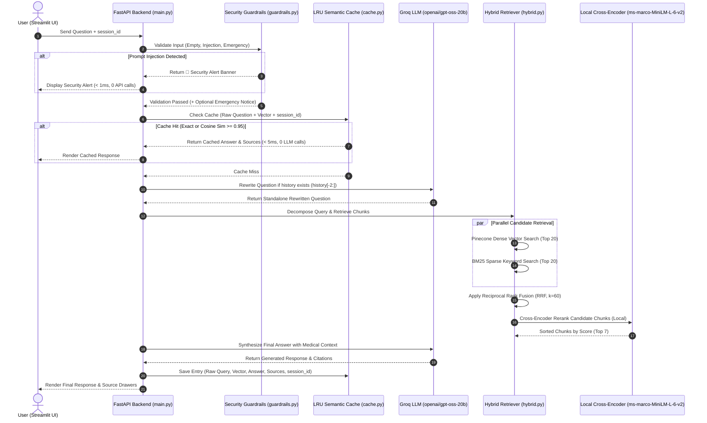

# 🩺 MediBot — System Architecture & Design Decision Summary

This document provides a comprehensive technical reference for the **MediBot Multi-Document Medical RAG Engine**. It covers all software components, libraries used, architectural decisions made during development, alternative choices considered, document chunking algorithms, table context preservation techniques, logger implementation, security layer architecture, a file-by-file directory index, REST API endpoint specs, scaling strategies, and a complete Code Review FAQ answering every technical question a reviewer or architect might ask.

> [!NOTE]
> **Shared Knowledge Base Architecture**: MediBot operates as a **Shared Medical Knowledge Base Engine**. Uploaded PDFs populate a centralized index accessible across sessions, making clinical guidelines and FDA reference documents globally searchable. Users can optionally restrict queries to a specific PDF using the Streamlit UI `file_name` dropdown filter.

---

## 🏗️ 1. High-Level Architecture & End-to-End Request Flow



---

## 🛠️ 2. Comprehensive Component & Technology Stack

| Layer | Component / Package | Function / Purpose |
| :--- | :--- | :--- |
| **Frontend UI** | `streamlit` | Interactive web application with session state, document catalog selection, chat message UI, and source metric cards. |
| **Backend REST API** | `fastapi`, `uvicorn`, `pydantic-settings` | High-throughput async web server, OpenAPI documentation, centralized environment settings, and schemas. |
| **LLM Provider** | `langchain-groq` (`ChatGroq`) | Primary inference LLM using **`openai/gpt-oss-20b`** (~200 tokens/sec) for question rewriting, decomposition, and final medical answer synthesis. |
| **Dense Embeddings** | `sentence-transformers` (`all-MiniLM-L6-v2`) | Generates 384-dimensional dense vector embeddings for text chunks and queries. |
| **Vector Database** | `pinecone-client`, `langchain-pinecone` | Serverless cloud vector index (`medicalassistant`, 384d, cosine distance) for dense semantic retrieval. |
| **Sparse Keyword Search** | `rank_bm25` | In-memory BM25 index evaluating token-set intersections for exact drug/chemical keyword matching. |
| **Local Reranker** | `sentence-transformers` (`CrossEncoder`) | Loads **`cross-encoder/ms-marco-MiniLM-L-6-v2`** in-memory to re-rank candidate chunks locally on CPU/GPU. |
| **Caching Layer** | `numpy`, custom `RAGQueryCache` | LRU Cache supporting exact hash matching and cosine vector similarity hits ($\ge 0.95$) with a 1-hour TTL, isolated per `session_id`. |
| **Security Layer** | `re` (Regex Engine) | Regex pattern matching for step-1 prompt injection interception and medical emergency triage warnings. |
| **Logger Module** | `logging`, `datetime`, `backend/logger.py` | Automated log rotation, formatting, line-number tracking, and runtime execution tracing. |
| **Document Processing** | `pypdf`, `langchain-community` | Header-aware section chunking (`RecursiveCharacterTextSplitter`) and structured CSV table row formatting. |
| **Containerization** | `docker`, `docker-compose` | Multi-stage container builds orchestrating backend and frontend services. |

---

## 📁 3. File-by-File Directory Map & File Descriptions

### Root Workspace Files
- **`Dockerfile`**: Multi-stage production container configuration installing system dependencies, PyTorch CPU, requirements, and exposing FastAPI (8000) & Streamlit (8501) ports.
- **`docker-compose.yml`**: Multi-service Docker orchestration file connecting backend and frontend containers on a shared network.
- **`.env.example`**: Template configuration detailing required environment variables (`GROQ_API_KEY`, `PINECONE_API_KEY`).
- **`requirements.txt`**: Unified Python dependency manifest pinning FastAPI, Streamlit, LangChain, Pinecone, SentenceTransformers, and Rank_BM25.
- **`README.md`**: Project overview, stack table, quickstart guide, and architectural design decision rationale.
- **`SUMMARY.md`**: Comprehensive technical reference, design decisions, chunking/table context breakdown, file map, REST specs, scaling strategies, and Code Review FAQ.

---

### Backend Core Server (`backend/`)
- **`backend/main.py`**: Principal FastAPI REST application entrypoint defining routes:
  - `POST /ask/`: Executes RAG query pipeline.
  - `POST /upload/`: Handles multi-file uploads (PDF/CSV) and indexing.
  - `POST /ingest-url/`: Ingests document from public URL.
  - `GET /catalog/`: Retrieves list of ingested files.
  - `DELETE /catalog/{doc_id}`: Deletes document from catalog and vector store.
  - `GET /health/`: Returns service status.
  - Mounts static uploads directory at `/static-files`.
- **`backend/config.py`**: Centralized Pydantic `BaseSettings` loading environment variables from `.env` (Groq key, Pinecone key, model parameters, ports).
- **`backend/logger.py`**: Configures Python `logging` to output timestamped log files (`YYYY-MM-DD_HH-MM-SS.log`) inside `backend/logs/` with line-number formatting (`%(lineno)d`).
- **`backend/exception.py`**: Custom `MedicalAssistantException` wrapper that intercepts runtime errors and formats stack tracebacks with the exact Python filename and line number (`tb_lineno`).

---

### AI & Core Processing (`backend/core/`)
- **`backend/core/chunker.py`**: `TextChunker` class executing Header-Aware Recursive Character Chunking (`[Section: ...]`) for document text while bypassing table rows to preserve row context.
- **`backend/core/embedder.py`**: `Embedder` class wrapping HuggingFace `SentenceTransformerEmbeddings` (`all-MiniLM-L6-v2`, 384d) with LRU query vector caching.
- **`backend/core/llm.py`**: `load_llm()` factory function initializing `ChatGroq` using `openai/gpt-oss-20b` (`temperature=0.1`, `max_tokens=1024`).

---

### Dual-Stage Retrieval Engine (`backend/retrieval/`)
- **`backend/retrieval/bm25.py`**: `BM25Retriever` implementing sparse keyword retrieval with token-set intersection evaluation to prevent false filtering on small document sets.
- **`backend/retrieval/pinecone_store.py`**: `PineconeVectorStoreManager` managing serverless index verification, 50-chunk batched upserts, and metadata tagging.
- **`backend/retrieval/hybrid.py`**: `HybridRetriever` orchestrating dense Pinecone search + sparse BM25 search + Reciprocal Rank Fusion (RRF, $k=60$) + local Cross-Encoder reranking (`ms-marco-MiniLM-L-6-v2`).

---

### Modular Security Layer (`backend/security/`)
- **`backend/security/prompt_injection.py`**: `PromptInjectionDetector` using wildcard regex pattern matching to intercept prompt injections (*"ignore earlier instructions"*) at Step 1 in **< 1ms**.
- **`backend/security/medical_safety.py`**: `MedicalSafetyDetector` evaluating emergency phrases (*chest pain, heart attack, can't breathe*) and returning an **URGENT MEDICAL NOTICE** advisory banner.
- **`backend/security/guardrails.py`**: `RAGGuardrails` central orchestrator validating input queries before any vector embedding or LLM invocation.

---

### Pydantic Data Schemas (`backend/schemas/`)
- **`backend/schemas/rag.py`**: Defines strict Pydantic request/response data models:
  - `QueryRequest`: Question text, session ID, filename filter, category filter.
  - `QueryResponse`: Generated answer, retrieved document sources, execution status.
  - `IngestURLRequest`: Document URL ingestion metadata.
  - `DocumentCatalogItem`: Filename, page count, upload timestamp, category.

---

### RAG State & Workflow Controller (`backend/rag/`)
- **`backend/rag/cache.py`**: `RAGQueryCache` in-memory LRU cache storing exact string matches and cosine vector similarity hits ($\ge 0.95$) with 1-hour TTL, partitioned by `session_id`.
- **`backend/rag/decomposer.py`**: `QueryDecomposer` evaluating complex queries (*"compare X vs Y"*) and decomposing them into 2–3 sub-queries using LLM.
- **`backend/rag/pipeline.py`**: `RAGPipeline` central workflow controller integrating Guardrails -> Cache -> Rewriting -> Decomposition -> Hybrid Retrieval -> Cross-Encoder Reranking -> LLM Answer Synthesis -> Cache Store.

---

### Document Loaders & Catalog (`backend/loader/`)
- **`backend/loader/catalog.py`**: `CatalogManager` managing in-memory tracking of uploaded files, page counts, and metadata.
- **`backend/loader/pdf_loader.py`**: `DocumentLoader` parsing PDFs (`PyPDFLoader`) and CSVs (`_load_csv_structured`), formatting table rows into explicit key-value strings (`[Table Row X]`).

---

### Web Frontend Application (`frontend/`)
- **`frontend/app.py`**: Interactive Streamlit web interface managing user session state (`uuid.uuid4()`), chat messaging UI, PDF/CSV file uploads, document catalog selection dropdowns, and expandable source citation cards with rerank scores.

---

### Automated Unit Test Suite (`tests/`)
- **`tests/conftest.py`**: Pytest environment configuration setting system path imports.
- **`tests/test_guardrails.py`**: Unit tests verifying prompt injection regex filtering (`"ignore earlier instructions"`) and emergency triage notices.
- **`tests/test_chunker.py`**: Unit tests verifying section header extraction and CSV table row preservation.
- **`tests/test_cache.py`**: Unit tests verifying exact string hits and cosine similarity vector caching.
- **`tests/test_decomposer.py`**: Unit tests verifying comparative query decomposition.
- **`tests/test_hotpotqa.py`**: Benchmark evaluation test suite verifying multi-hop question answering across document chunks.

---

## 🌐 4. REST API Endpoints & FastAPI Architecture

FastAPI serves as the high-throughput asynchronous REST backend. All endpoints are defined in [`backend/main.py`](file:///C:/Users/sohit/.gemini/antigravity/scratch/RAG_prgrade/backend/main.py):

| Method | Endpoint | Request Payload | Response Model | Description |
| :--- | :--- | :--- | :--- | :--- |
| **`POST`** | `/ask/` | `QueryRequest` (`question`, `session_id`, `file_name`, `category`) | `QueryResponse` (`answer`, `sources`, `chunks_text`) | Primary RAG Execution endpoint. Triggers guardrails, cache, rewriting, hybrid retrieval, reranking, and LLM synthesis. |
| **`POST`** | `/upload/` | `UploadFile` (Multipart PDF/CSV), `category` | JSON (`doc_id`, `chunks_created`) | Parses document, generates chunks, batch-upserts 50-chunk batches to Pinecone, and updates BM25 sparse index. |
| **`POST`** | `/ingest-url/` | `IngestURLRequest` (`url`, `category`) | JSON (`doc_id`, `filename`, `chunks_created`) | Downloads document from public URL and ingests it into vector & BM25 indices. |
| **`GET`** | `/catalog/` | None | JSON List (`DocumentCatalogItem`) | Returns metadata list of all active uploaded documents in the knowledge base. |
| **`DELETE`** | `/catalog/{doc_id}` | Path Parameter `doc_id` | JSON Confirmation | Deletes document metadata, removes Pinecone vectors, and clears BM25 sparse index. |
| **`GET`** | `/health/` | None | `{"status": "healthy"}` | Health check probe endpoint for AWS ALB / Kubernetes load balancers. |

---

## 🚀 5. Scaling Strategy (Backend & Frontend Horizontal/Vertical Scaling)

### Scaling the FastAPI Backend

1. **Process-Level Multi-Worker Scaling (Gunicorn + Uvicorn Workers)**
   - Instead of running a single `uvicorn main:app` process on 1 CPU core, launch Gunicorn process manager with multiple Uvicorn workers (`uvicorn.workers.UvicornWorker`) matching CPU cores:
     ```bash
     gunicorn backend.main:app -w 4 -k uvicorn.workers.UvicornWorker --bind 0.0.0.0:8000
     ```

2. **Horizontal Container Autoscaling (Kubernetes HPA / AWS ECS)**
   - Deploy FastAPI backend container replicas behind an **AWS Application Load Balancer (ALB)** or **NGINX Reverse Proxy**.
   - Set up **Kubernetes Horizontal Pod Autoscaler (HPA)** triggered when CPU usage exceeds 70% or HTTP request queue depth increases.

3. **Externalizing In-Memory State to Redis**
   - **Session Storage**: Replace `self.sessions` Python dict in `pipeline.py` with **Redis Hash Store** (`redis.hset(session_id, ...)`).
   - **RAG Cache**: Replace `RAGQueryCache` with **Redisearch / Redis Vector Cache** (`redis-py`).
   - *Result*: Any backend replica can serve any incoming request statelessly.

4. **Async Background Task Queue for Heavy Document Uploads (Celery + SQS/Redis)**
   - Move `/upload/` document processing to a **Celery Worker Task Queue**:
     - User uploads PDF $\rightarrow$ API immediately returns `202 Accepted` with a `task_id` in 50ms.
     - Background Celery workers parse, chunk, embed, and upsert vectors to Pinecone without blocking API web workers.

---

### Scaling the Streamlit Frontend

1. **Container Replicas + Sticky Sessions (Session Affinity)**
   - Deploy multiple Streamlit UI container instances behind NGINX / Cloudflare ALB.
   - Enable **Sticky Sessions (Session Affinity Cookies)** on the Load Balancer so a user's WebSocket connection stays pinned to the same Streamlit container instance during their chat session.

2. **Independent Tier Decoupling**
   - The Streamlit frontend (`frontend/app.py`) is completely decoupled from backend data; it makes HTTP REST calls to `http://backend:8000`.
   - Frontend instances (rendering HTML/CSS) and Backend instances (running vector search & LLM logic) scale independently based on their unique load patterns.

---

## 🧪 6. Verification & Testing Strategy

- **Test Suite**: Located in `tests/` (`test_guardrails.py`, `test_chunker.py`, `test_cache.py`, `test_decomposer.py`, `test_hotpotqa.py`).
- **Execution Command**: `python -m unittest discover tests`
- **Current Status**: **10 / 10 Unit Tests Passing Cleanly (`OK`)**.

---

## ❓ 7. Code Review & Technical FAQ

### Architecture & Pipeline
#### Q1: Why did we choose Pinecone DB over FAISS or local vector stores?
> **Answer**: Pinecone provides serverless cloud scaling, sub-50ms latency, native metadata filtering (`filename`, `category`), and zero infrastructure maintenance. In [`backend/retrieval/hybrid.py`](file:///C:/Users/sohit/.gemini/antigravity/scratch/RAG_prgrade/backend/retrieval/hybrid.py#L42-L54), the system auto-creates a 384-dimensional serverless index if it doesn't exist.

#### Q2: What happens during Cross-Encoder reranking?
> **Answer**: Reranking takes the top 20 dense candidates (Pinecone) and top 20 sparse candidates (BM25), merges them using Reciprocal Rank Fusion (RRF, $k=60$), and passes `(Query, Chunk)` pairs into `cross-encoder/ms-marco-MiniLM-L-6-v2`. The transformer evaluates joint attention across query and chunk text simultaneously, outputs logit relevance scores, sorts candidates descending, and returns the top 7 most relevant chunks to the LLM.

#### Q3: How is the logger module built and how does it assist in troubleshooting?
> **Answer**: `backend/logger.py` configures timestamped log files (`YYYY-MM-DD_HH-MM-SS.log`) inside `backend/logs/`. It records exact line numbers (`%(lineno)d`), execution steps (guardrails, cache hits/misses, rewritten queries, rerank scores), and integrates with `MedicalAssistantException` in `backend/exception.py` to pinpoint exact line numbers for any runtime exception.

#### Q4: How does the security layer function?
> **Answer**: `RAGGuardrails` orchestrates pre-retrieval validation:
> 1. `PromptInjectionDetector`: Intercepts adversarial prompts (*"ignore earlier instructions"*) in $< 1\text{ ms}$ using wildcard regex pattern matching before vector retrieval or LLM execution.
> 2. `MedicalSafetyDetector`: Identifies life-threatening emergencies (`chest pain`, `heart attack`, `can't breathe`) and attaches an **URGENT MEDICAL NOTICE** advising emergency services (911) while serving document context.

#### Q5: What type of chunking is used for text sections and tabular data?
> **Answer**: We use **Header-Aware Recursive Character Chunking** (`TextChunker`) for text and **Structured Key-Value Row Binding** (`DocumentLoader`) for tables:
> - Text chunks are prepended with their section heading: `[Section: Section_Name]`.
> - CSV/Table rows are formatted into explicit key-value strings (`[Table Row 25] Drug: Metformin | Dosage: 500mg`) and bypass character splitting, ensuring table context is **never fragmented or lost**.
